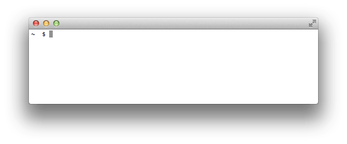

# Ruby Drill: Command Line Arguments

## Summary
When we write an application, we sometimes need to get data from the user.  For example, if we wanted to write an application that allows users to convert English to Pig Latin, the user would need to supply the English.  One option is to build a user interface that asks the user for input.  We can see an example of this in Figure 1.

  
*Figure 1*.  A script which prompts the user for input.

Alternatively, we can write an application so that users pass in data right when the application is executed.  In other words, users supply *command line arguments* when they run the application.  Just like passing arguments to a method when we call it, we can provide arguments to our applications when we run them.  We can see an example of this in Figure 2.

  
*Figure 2*.  A script which relies on command line arguments.

### Accessing Command Line Arguments
If a user runs our application and passes in command line arguments, how do we access them?  In what format are they in?

When we execute a Ruby script, Ruby creates a constant for us: `ARGV`—short for argument vector.  The value of `ARGV` is always an array.  Each of the command line arguments we pass when running the script becomes an element in the array—specifically, each argument is a string in the array.

When we execute a Ruby script we use the `ruby` command followed by the name of the file to run.  Any additional text is used as the command line arguments. Each individual word is considered a separate argument, but we can use quotation marks to get around this.  In Table 1, we have some examples of running a ruby script and what ARGV would look like in each example.

| Executing the Script                | Value of `ARGV` in Ruby |
| :--                                 | :---                    |
| `$ ruby runner.rb`                  | `[]`                    |
| `$ ruby runner.rb Chris`            | `["Chris"]`             |
| `$ ruby runner.rb Chris Seidel`     | `["Chris", "Seidel"]`   |
| `$ ruby runner.rb "Chris Seidel"`   | `["Chris Seidel"]`      |
| `$ ruby runner.rb "Chris Seidel" 5` | `["Chris Seidel", "5"]` |

*Table 1*.  Example `ARGV` values based on command line arguments.

## Releases
### Release 0: Refactor to Use Command Line Arguments
Take a minute to run the provided script:  `ruby runner.rb`.  We'll be asked to input two words, and the script will report whether or not the two words we input are anagrams.

Refactor the code in the file `runner.rb` so that instead of asking the user for input, the user provides both words as command line arguments.  Remember, each command line argument will be accessible as a string in the `ARGV` array.